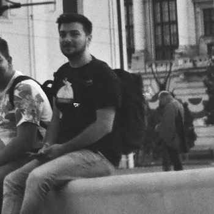

# 🙋‍♂️ _Hi, friend!_ 

You are here either because I directed you here or because you've stalked me around on the internet. Either way, nice to meet you. This is my Github personal landing page. There's not much here, but I hear it's a nice blogging platform.

## 🔍 `whoami`

My name is **Cristian Ilea**. I am a software engineer based in **Europe🇪🇺**. I do freelancing **iOS**📱 work by day and **AI / Machine Learning📈** by night - which actually means that I am finishing my Master's degree in **Applied Computational Intelligence🧠**.

<!--
-->
## 🗺 Location

I am currently based in beautiful **Cluj-Napoca, Romania🇷🇴**.
Here's a picture of the place:

## 📞 Contact

I am available via [**email**](mailto:ileacristian@gmail.com), and [**Twitter**](https://www.twitter.com/ileacristian) at all times. Please feel free to contact me if you have any business inqiries, questions or you just want to say hi.